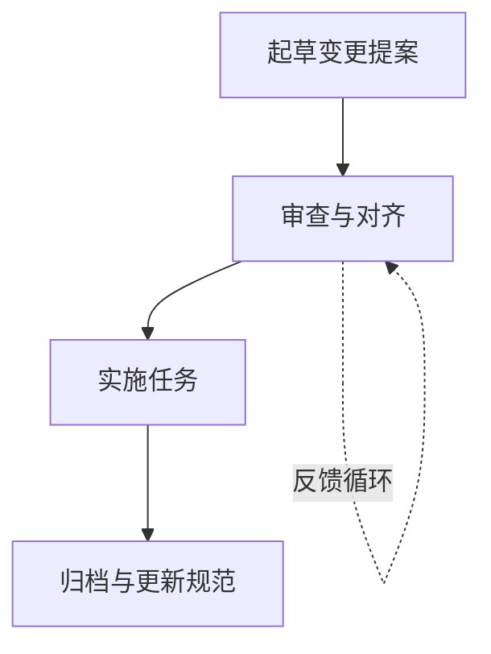

## 什么是规范驱动开发

规范驱动开发（Specification-Driven Development，简称 SDD）是一种软件开发方法论，它强调在编写任何代码之前，先通过明确的规范来定义需求和行为。这种方法确保所有参与者——包括人类开发者、AI 编程助手和其他利益相关者——对要构建的内容达成共识，从而实现可预测、可审查的输出。

传统开发流程中，需求往往分散在聊天记录、文档和口头沟通中，这导致 AI 编程助手生成代码时缺乏明确的上下文，容易产生偏离预期的结果。规范驱动开发通过将需求结构化、显式化，解决了这个问题。

## 为什么需要规范驱动开发

### AI 时代的挑战

随着 AI 编程助手（如 Claude Code、Cursor、GitHub Copilot 等）的普及，开发者与 AI 的协作日益频繁。然而，这些工具虽然强大，但在以下方面存在挑战：

- **不可预测性**：需求存在于聊天历史中，AI 可能误解或遗漏关键信息
- **缺乏上下文**：AI 难以理解项目的整体架构和约束条件
- **结果不一致**：类似的请求可能产生不同的输出
- **难以审查**：无法明确追踪需求到实现的映射关系

### 规范驱动开发的优势

规范驱动开发通过以下方式解决了这些挑战：

- **共识先行**：在编码前，所有利益相关者就规范达成一致
- **结构化变更**：提案、任务和规范更新存储在结构化文件夹中，范围明确且可审计
- **可视化追踪**：清晰展示哪些提案处于提议、活跃或归档状态
- **工具无关性**：可与任何 AI 工具配合使用，通过自定义斜杠命令或上下文规则实现集成

## OpenSpec：规范驱动开发的实践工具

[OpenSpec](https://github.com/Fission-AI/OpenSpec) 是一个实现规范驱动开发的轻量级工具，它为 AI 编程助手提供了一套结构化的工作流。

### 核心特性

#### 1. 轻量级工作流

OpenSpec 的设计理念是简单易用：

- 无需 API 密钥
- 最小化设置
- 与现有 AI 工具无缝集成

#### 2. 优先支持 Brownfield 项目

与专注于新项目（0→1）的工具不同，OpenSpec 在修改现有功能（1→n）方面表现出色，尤其是当更新涉及多个规范时。它采用双文件夹模型：

- `openspec/specs/`：存储当前的事实源（规范）
- `openspec/changes/`：存储提议的更新（提案）

这种设计使差异显式化且易于管理，确保变更的追踪和审查。

#### 3. 变更追踪

OpenSpec 将提案、任务和规范差异存储在一起，归档操作会将批准的更新合并回规范中，形成完整的历史记录。

### 工作流程

OpenSpec 的工作流程包含以下四个步骤：



#### 步骤 1：起草变更提案

创建一个变更提案，捕获你想要的规范更新。提案应包含：

- **背景和目标**：为什么需要这个变更
- **规范差异**：对现有规范的修改、新增或删除
- **任务清单**：实现变更所需的具体步骤

#### 步骤 2：审查与对齐

与你的 AI 助手审查提案，直到所有方达成一致。这个阶段可能需要多次迭代：

```
你：能为角色和团队过滤器添加验收标准吗？
AI：我会更新规范差异，添加角色和团队过滤器的场景。
（编辑 openspec/changes/add-profile-filters/specs/profile/spec.md 和 tasks.md）
```

#### 步骤 3：实施任务

一旦规范满足需求，开始实施。AI 会根据任务清单逐步实现功能，标记完成的任务。

```
你：规范看起来不错。让我们实施这个变更。
AI：我会处理 add-profile-filters 变更中的任务。
（实施 openspec/changes/add-profile-filters/tasks.md 中的任务）
（标记任务完成：任务 1.1 ✓，任务 1.2 ✓，任务 2.1 ✓...）
```

#### 步骤 4：归档与更新规范

实施完成后，归档变更将批准的更新合并回事实源规范。

```
你：所有任务都完成了。实施已准备好。请归档变更。
AI：我会归档 add-profile-filters 变更。
（运行：openspec archive add-profile-filters --yes）
✓ 变更归档成功。规范已更新。准备好开始下一个功能！
```

### 文件结构

当要求 AI 助手添加功能时，它会创建以下结构：

```
openspec/
├── specs/
│   └── auth/
│       └── spec.md           # 当前认证规范（如果存在）
└── changes/
    └── add-2fa/              # AI 创建这个完整结构
        ├── proposal.md       # 为什么和什么变更
        ├── tasks.md          # 实现检查清单
        ├── design.md         # 技术决策（可选）
        └── specs/
            └── auth/
                └── spec.md   # 差异显示添加
```

#### 规范示例

**当前规范**（`openspec/specs/auth/spec.md`）：

```markdown
# 认证规范

## 目的
身份验证和会话管理。

## 需求
### 需求：用户认证
系统应在成功登录时颁发 JWT。

#### 场景：有效凭证
- 当用户提交有效凭证时
- 那么返回 JWT
```

**变更差异**（`openspec/changes/add-2fa/specs/auth/spec.md`）：

```markdown
# 认证差异

## 新增需求
### 需求：双因素认证
系统必须在登录期间要求第二个因素。

#### 场景：需要 OTP
- 当用户提交有效凭证时
- 那么要求 OTP 挑战
```

#### 任务示例（`openspec/changes/add-2fa/tasks.md`）：

```markdown
## 1. 数据库设置
- [ ] 1.1 向用户表添加 OTP 密钥列
- [ ] 1.2 创建 OTP 验证日志表

## 2. 后端实现
- [ ] 2.1 添加 OTP 生成端点
- [ ] 2.2 修改登录流程以要求 OTP
- [ ] 2.3 添加 OTP 验证端点

## 3. 前端更新
- [ ] 3.1 创建 OTP 输入组件
- [ ] 3.2 更新登录流程 UI
```

## 与其他方法的对比

### vs. spec-kit

spec-kit 在新项目（0→1）方面表现强劲，但在跨规范更新和演进功能方面提供的结构较少。OpenSpec 的双文件夹模型将状态和差异分离，在修改现有功能或涉及多个规范时更具扩展性。

### vs. Kiro.dev

Kiro 将更新分散在多个规范文件夹中，使得功能跟踪变得更加困难。OpenSpec 将每个功能的所有变更组织在一个文件夹中（`openspec/changes/feature-name/`），更容易一起跟踪相关规范、任务和设计。

### vs. 无规范

没有规范，AI 编程助手从模糊的提示生成代码，经常遗漏需求或添加不需要的功能。规范驱动开发通过在任何代码编写前就期望的行为达成一致，带来可预测性。

## 支持的 AI 工具

OpenSpec 与多种主流 AI 编程工具集成，提供原生的斜杠命令支持：

- **Claude Code**：`/openspec:proposal`、`/openspec:apply`、`/openspec:archive`
- **Cursor**：`/openspec-proposal`、`/openspec-apply`、`/openspec-archive`
- **GitHub Copilot**：`/openspec-proposal`、`/openspec-apply`、`/openspec-archive`
- **OpenCode**：`/openspec-proposal`、`/openspec-apply`、`/openspec-archive`
- **其他工具**：通过 `AGENTS.md` 约定自动读取工作流指令

对于支持 AGENTS.md 约定的工具（如 Amp、Jules 等），只需告诉它们遵循 OpenSpec 工作流即可。

## 快速开始

### 安装与初始化

**前提条件**：Node.js >= 20.19.0

1. **全局安装 CLI**

```bash
npm install -g @fission-ai/openspec@latest
```

验证安装：

```bash
openspec --version
```

2. **在项目中初始化 OpenSpec**

```bash
cd my-project
openspec init
```

初始化过程中：

- 系统会提示你选择原生的 AI 工具（Claude Code、Cursor、OpenCode 等）
- OpenSpec 自动为你选择的工具配置斜杠命令
- 在项目根目录创建 `openspec/` 目录结构
- 创建 `openspec/project.md` 用于定义项目级别的约定和标准

### 创建你的第一个变更

#### 1. 起草提案

要求 AI 创建变更提案：

```
你：创建一个 OpenSpec 变更提案，用于添加按角色和团队的个人资料搜索过滤器
（支持斜杠命令的工具：/openspec:proposal 添加个人资料过滤器）

AI：我会为个人资料过滤器创建一个 OpenSpec 变更提案。
（搭建 openspec/changes/add-profile-filters/，包含 proposal.md、tasks.md、规范差异）
```

#### 2. 验证与审查

```bash
$ openspec list                          # 确认变更文件夹存在
$ openspec validate add-profile-filters  # 验证规范格式
$ openspec show add-profile-filters      # 审查提案、任务和规范差异
```

#### 3. 实施变更

```
你：规范看起来不错。让我们实施这个变更。
（支持斜杠命令的工具：/openspec:apply add-profile-filters）

AI：我会处理 add-profile-filters 变更中的任务。
（实施 openspec/changes/add-profile-filters/tasks.md 中的任务）
（标记任务完成：任务 1.1 ✓，任务 1.2 ✓，任务 2.1 ✓...）
```

#### 4. 归档完成的变更

```
你：所有任务都完成了。请归档变更
（支持斜杠命令的工具：/openspec:archive add-profile-filters）

AI：我会归档 add-profile-filters 变更。
（运行：openspec archive add-profile-filters --yes）
✓ 变更归档成功。规范已更新。准备好开始下一个功能！
```

或在终端中自行运行：

```bash
openspec archive add-profile-filters --yes  # 非交互式归档
```

## 常用命令

```bash
openspec list               # 查看活动变更文件夹
openspec view               # 规范和变更的交互式仪表板
openspec show <change>      # 显示变更详情（提案、任务、规范更新）
openspec validate <change>  # 检查规范格式和结构
openspec archive <change>   # 将完成的变更移动到 archive/（使用 --yes 非交互式）
```

## 团队采用

1. **初始化 OpenSpec**：在仓库中运行 `openspec init`
2. **从新功能开始**：要求 AI 将即将进行的工作捕获为变更提案
3. **增量增长**：每个变更都归档到描述系统的活规范中
4. **保持灵活**：不同的团队成员可以使用 Claude Code、Cursor 或任何 AGENTS.md 兼容的工具，同时共享相同的规范

当有人切换工具时，运行 `openspec update`，使你的代理获取最新的指令和斜杠命令绑定。

## 实验性功能

### OPSX：流畅、迭代的工作流

OpenSpec 提供了一个实验性的工作流（仅限 Claude Code），解决了标准工作流的局限性：

- **可黑客修改**：编辑模板和架构，立即测试，无需重建
- **细粒度**：每个工件都有自己的指令，可单独测试和调整
- **可定制**：定义自己的工作流、工件和依赖关系
- **流畅**：没有阶段门，随时更新任何工件

```
proposal ──→ specs ──→ design ──→ tasks ──→ implement
   ▲           ▲          ▲                    │
   └───────────┴──────────┴────────────────────┘
```

命令：
- `/opsx:new`：开始新变更
- `/opsx:continue`：创建下一个工件
- `/opsx:ff`：快进（一次性所有规划工件）
- `/opsx:apply`：实施任务，根据需要更新工件
- `/opsx:archive`：完成后归档

设置：`openspec artifact-experimental-setup`

## 差异格式

差异是显示规范如何变化的"补丁"：

- **`## 新增需求`**：新功能
- **`## 修改需求`**：更改的行为（包含完整的更新文本）
- **`## 删除需求`**：弃用的功能

**格式要求**：

- 使用 `### 需求：<名称>` 作为标题
- 每个需求至少需要一个 `#### 场景：` 块
- 在需求文本中使用 SHALL/MUST

## 总结

规范驱动开发为 AI 时代的软件开发提供了一种结构化的方法，通过在编码前明确需求和规范，提高了开发效率和代码质量。OpenSpec 作为实现这一理念的工具，提供了轻量级、灵活的工作流，支持多种 AI 编程助手，帮助团队实现可预测、可审查的开发流程。

无论你是个人开发者还是团队成员，规范驱动开发都能帮助你更好地与 AI 编程助手协作，构建更高质量的软件。

## 参考资料

- [OpenSpec GitHub 仓库](https://github.com/Fission-AI/OpenSpec)
- [OpenSpec 官方网站](https://openspec.dev/)
- [AGENTS.md 约定](https://agents.md/)
